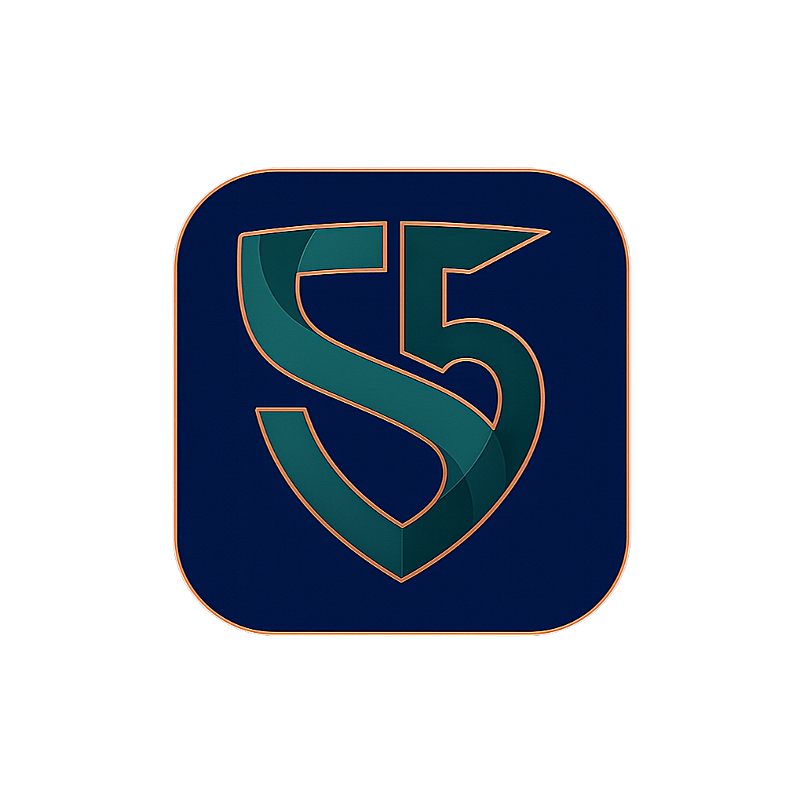

# Sur5 Lite — Open Source Edge AI

<p align="center">
  
</p>

> ⚠️ **Trademark Notice**: The Sur5ve™ name is a trademark of Sur5ve LLC, filed with the United States Patent and Trademark Office (USPTO) and is **NOT covered by the MIT License**. See [TRADEMARK.md](TRADEMARK.md) for usage policy.

**Offline, Portable, No Cloud**

**Sur5 Lite** is an open source Edge AI assistant that runs entirely on your device.
No cloud, no API keys, no data ever leaving your computer.

Built by [Sur5ve LLC](https://sur5ve.com).

---

## ✨ Features

- 🔌 **100% Offline** — True Edge AI, no internet required
- 🧠 **Multiple Backends** — Supports llama.cpp and BitNet.cpp
- 🎨 **Beautiful UI** — Modern PySide6 interface with multiple themes
- 💭 **Thinking Mode** — Watch Sur reason through problems step-by-step
- 📱 **Portable** — Run from USB on any computer
- 🔒 **Private by Design** — Your conversations never leave your device

---

## 📥 Quick Start

### 1. Clone the repository

```bash
git clone https://github.com/Sur5ve/Sur5-Lite.git
cd Sur5-Lite/App
```

### 2. Create a virtual environment (recommended)

```bash
python -m venv venv

# Windows
venv\Scripts\activate

# macOS/Linux
source venv/bin/activate
```

### 3. Install dependencies

```bash
pip install -r requirements.txt
```

### 4. Download a model

Sur5 Lite works with GGUF-format models. We recommend:

- **Qwen2.5-3B-Instruct** (3GB) — Good balance of speed and quality
- **Phi-3-mini** (2GB) — Smaller and faster
- **Llama-3.2-3B** (3GB) — Great for general conversation

Place your `.gguf` model file in the `models/` directory.

### 5. Run Sur5 Lite

```bash
python launch_sur5.py
```

---

## 📋 Requirements

- **Python 3.11+**
- **4GB+ RAM** (8GB recommended for larger models)
- **Any modern CPU** (GPU optional but improves performance)

### Supported Platforms

| Platform | Status | Notes |
|----------|--------|-------|
| Windows 10/11 | ✅ Full support | CUDA acceleration available |
| macOS (Apple Silicon) | ✅ Full support | Metal acceleration enabled |
| macOS (Intel) | ✅ Supported | CPU-only, slower |
| Linux | ✅ Full support | CUDA or CPU |

---

## 🎨 Themes

Sur5 Lite includes the **Sur5ve** theme — a modern dark theme with teal accents designed for comfortable extended use.

Additional themes can be added by creating JSON files in `sur5_lite_pyside/themes/theme_data/`.

Change themes via **View → Theme** in the menu bar.

---

## 🧠 Inference Backends

Sur5 Lite supports multiple inference backends:

### llama.cpp (Default)

The primary backend for standard GGUF models. Supports:
- 2-8 bit quantization (Q4_K_M, Q5_K_M, etc.)
- GPU acceleration (Metal, CUDA)
- Flash attention for large contexts

### BitNet.cpp (Coming Soon)

Next-generation backend for 1-bit quantized models:
- Up to 10x smaller model sizes
- Minimal quality loss
- Extremely fast inference

---

## ⌨️ Keyboard Shortcuts

| Shortcut | Action |
|----------|--------|
| `Enter` | Send message |
| `Shift+Enter` | New line |
| `Ctrl+N` | New conversation |
| `Ctrl+X` | Clear chat |
| `Ctrl+O` | Select model |
| `Ctrl+F` | Find in chat |
| `F3` / `Shift+F3` | Find next/previous |
| `Escape` | Stop generation |
| `Ctrl+Shift+S` | Save conversation |
| `Ctrl+Shift+T` | Export as text |
| `Ctrl+Shift+M` | Export as markdown |

---

## 🔧 Configuration

### RAM Presets

Sur5 Lite automatically detects your system hardware and selects an appropriate preset:

| Preset | Context Size | Best For |
|--------|-------------|----------|
| Ultra | 512 tokens | 4GB RAM systems |
| Minimal | 2K tokens | Low-end systems |
| Fast | 8K tokens | Mid-range (8GB+ RAM) |
| Balanced | 24K tokens | High-end (16GB+ RAM) |
| Power | 32K tokens | Workstation (24GB+ RAM) |

---

## 🤝 Contributing

We welcome contributions! Please read our [Contributing Guide](CONTRIBUTING.md).

### Development Setup

```bash
# Clone with development tools
git clone https://github.com/Sur5ve/Sur5-Lite.git
cd Sur5-Lite/App

# Install with dev dependencies
pip install -r requirements.txt

# Run in development mode
python launch_sur5.py
```

---

## 📄 License

Sur5 Lite source code is licensed under the [MIT License](LICENSE).

**This means:**

- ✅ Free for personal, educational, and commercial use
- ✅ You can view, modify, and share the source code
- ✅ Contributions welcome under the same license
- ✅ Use it however you want, just include the copyright notice

### ⚠️ Trademark Exclusion

The MIT License covers **source code only**. The following are **NOT** open source:

| Asset | Status |
|-------|--------|
| Sur5™ name | 🔒 Trademark of Sur5ve LLC |
| Sur5ve™ name | 🔒 Trademark of Sur5ve LLC |
| Sur5 logos | 🔒 Copyright Sur5ve LLC |
| Sur5 icons | 🔒 Copyright Sur5ve LLC |

**If you fork this project**, you must remove all Sur5/Sur5ve branding and create your own.

See [TRADEMARK.md](TRADEMARK.md) for complete policy.

---

## 🙏 Credits

Created with ❤️ by [Sur5ve LLC](https://sur5ve.com)

### Powered By

- [llama.cpp](https://github.com/ggerganov/llama.cpp) — Fast LLM inference
- [BitNet.cpp](https://github.com/microsoft/BitNet) — 1-bit LLM inference
- [PySide6](https://www.qt.io/qt-for-python) — Cross-platform UI

---

## 📞 Support

- **Issues**: [GitHub Issues](https://github.com/Sur5ve/Sur5-Lite/issues)
- **Email**: support@sur5ve.com
- **Website**: https://sur5ve.com
